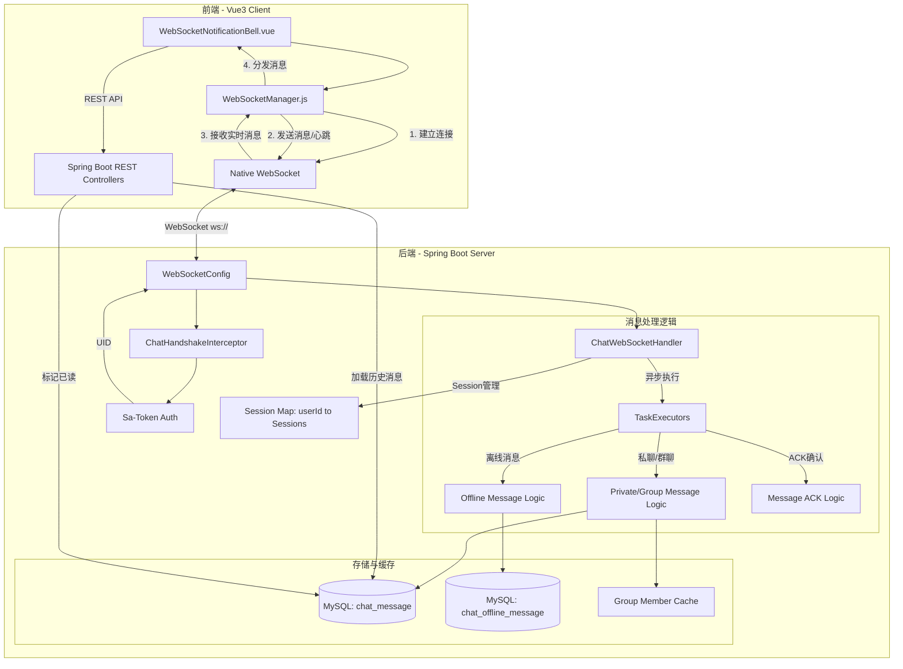

欢迎来到我的全新结界。经过了数次的重构与设计，这里终于拥有了我理想中的黑客与二次元交织的极致冷酷感。

## 序章

在这个数字化的虚空世界中，每一个比特都承载着我的意志。在这里，你可能会看到关于编程魔法的代码片段，也可能是某个午后对一部冷门番剧的碎碎念。

```python
def cast_magic():
    print("Hello, Digital World!")
    return True
```

*保持优雅，保持好奇。*

---

# WebSocket 架构图 (WebSocket Architecture)

本文档描述了 Workflow Engine 项目中 WebSocket 实时消息系统的整体架构设计，包含前端连接管理、后端处理逻辑、鉴权流程及消息持久化机制。

## 1. 整体架构图



## 2. 组件说明

### 2.1 前端组件 (Frontend Components)

*   **WebSocketManager.js**: 核心连接管理器。
    *   **职责**: 维护单例连接、自动重连（指数退避策略）、发送心跳（30s ping/pong）、消息 JSON 解析及发布订阅模式。
    *   **鉴权**: 从 `localStorage` 获取 `Admin-Token` 并通过 URL 参数传递。
*   **WebSocketNotificationBell.vue**: 顶部导航条的通知组件。
    *   **职责**: 展示实时通知、统计未读数、展示消息弹窗、与后端交互同步已读状态。
    *   **逻辑**: 首次加载时通过 REST API 获取历史消息，随后通过 WebSocket 接收实时增量消息。

### 2.2 后端组件 (Backend Components)

*   **ChatHandshakeInterceptor**: 握手拦截器。
    *   **职责**: 在 WebSocket 握手阶段利用 `Sa-Token` 验证 Token 的合法性，并将解析出的 `userId` 存入 WebSocket Session 的属性中。
*   **ChatWebSocketHandler**: 消息核心处理器。
    *   **职责**: 
        *   **Session 管理**: 在内存中维护 `userId` 到 `Set<WebSocketSession>` 的映射，支持同一用户多设备/多标签页同时在线。
        *   **异步处理**: 使用自定义线程池处理业务逻辑，防止 IO 阻塞 WebSocket 主线程。
        *   **协议支持**: 处理 `PRIVATE_MESSAGE`（私聊）、`GROUP_MESSAGE`（群聊）、`PING`（心跳）、`MESSAGE_ACK`（消息回执）等多种消息格式。
*   **TaskExecutors**: 线程池管理。
    *   **职责**: 隔离 WebSocket IO 线程与具体的业务处理逻辑。

### 2.3 存储机制 (Storage Mechanism)

*   **实时性**: 消息优先推送给在线 Session。
*   **持久化**: 
    *   `chat_message`: 存储全量消息历史。
    *   `chat_offline_message`: 存储用户离线期间收到的消息，待用户上线后自动推送。
*   **消息回执 (ACK)**: 前端收到消息后发送 ACK，后端更新消息状态（已送达/已读），确保消息不丢失。

---
*文档由 Antigravity 自动生成于 2026-03-24*