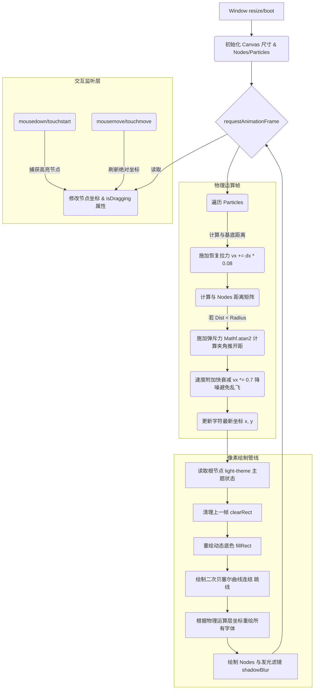

为了将博客的极简赛博风贯彻到底，我在这两天实现了一个非常有实验性的页面——**“次元（Absolute Terror Field）”**。

灵感来源于 [Chenglou/Pretext](https://github.com/chenglou/pretext) 震撼的排版避让效果，但与之不同的是，我们没有引入庞大的 React 生态或外网后端。我仅仅通过 **原生 HTML5 `<canvas>`** 和百行的纯 JavaScript 物理弹簧算法，就在静态博客中复现了满屏字母的引力场效果。

---

## Ⅰ. 核心技术痛点解析

构建这套纯前端交互矩阵涉及到了多个底层问题：
1. **真实物理模拟与碰撞检测**：字符不仅要躲开我们的光标/节点，离开后还要像挂着弹簧一样优雅地“崩”回原位。
2. **主题同步 (Theme Awareness)**：传统的 `<canvas>` 绘图是静态像素，无法跟随博客左上角的“月亮/太阳”白天黑夜模式自动变色。
3. **MacBook 触控板事件劫持**：苹果 Safari 或 Chrome 中的触控板惯性拖拽容易被识别为滚动而打断物理坐标采集。
4. **代码压缩引擎的“静默暗杀”**：由于博客应用了 HTML 代码压缩机制，一段无害的 "//" 注释引发了长达半天的黑屏惨案（后文详述）。

---

## Ⅱ. 物理引擎运转架构

为了彻底搞清这个循环结构，我梳理了整个引擎渲染和处理的管线（Pipeline）。



---

## Ⅲ. 血泪踩坑指南

在实现这套机制时，除了算法上的调整，这三个堪称隐形杀手的坑耗费了最多时间：

### 1. Jekyll `compress` HTML 压缩器与 JavaScript 的量子纠缠
在这个系统中，最离谱的 Bug 就是——**页面在本地开发正常，一旦推送到 GitHub Action 部署后，整个 Canvas 画面只剩下一片纯黑幕布，代码抛出完全隐藏的闪退。**

最终发现问题的核心竟是：
博客为了性能使用了 `` 模块来极度压缩 HTML 代码。它会在构建时**粗暴地删掉 HTML 里的所有换行符（Newline）**。
这导致我在 `<script>` 里的 `// 计算反向推力` 等单行注释，因为失去了“换行”保护，硬生生地把 `//` 后面长达几百行的核心 Javascript 全部当成了注释给吃掉了，直接引发**严重词法 SyntaxError**。

**修复方案：** 必须在静态博客的直接内联脚本中强制放弃 `//` 单行注释，严格采用 `/* Block 注释 */` 以防被压缩器吞断语境。

### 2. Mac 触控板拖拽与视口滚动
原本仅绑定了 `mousemove`，发现 Mac 触控板点按拖拽时常常失灵。
这是因为触控板微小的移动经常被浏览器判定位系统级别 `Scroll` 而阻止事件。解决方案必须两路齐发：
1. **CSS 钳制**：为 Canvas 对象加上 `touch-action: none !important;` 彻底禁用所有的手势。
2. **主动拦截**：在 JS 监听事件中，加入 `if (e.cancelable) e.preventDefault();` 拒绝原始滚轮和上滑操作，抢夺坐标归属权。
3. **扩大点击域**：将节点抓取判断放宽到了勾股定理距离求交的 `dx*dx + dy*dy < 2500`（50px 半径范围），让触控板不再需要肉眼追踪 1 个特定细微像素。

### 3. 主题（Theme Awareness）的解耦跟随
Canvas 原生是不讲 CSS `color: red` 道理的，它只读十六进制。为了能随着用户手头的**“白昼/暗夜”模式**实时切换效果。我们巧妙地使用 JS 将检测逻辑融入了 60fps 的 `animate()` 循环中：
```javascript
function isLightTheme() {
    return document.documentElement.classList.contains('light-theme');
}
```
每一帧都会嗅探博客是否注入了发白的主题雷达，随后智能重配文字为 “墨水蓝/赛博紫外”。至此，一套**不需要 React，不需要后端计算，甚至不需要外部 NPM 包**的高能静态实验室绝对领域落地了！

快去上方导航栏体验 **[次元]** 的自动排版威力吧！
